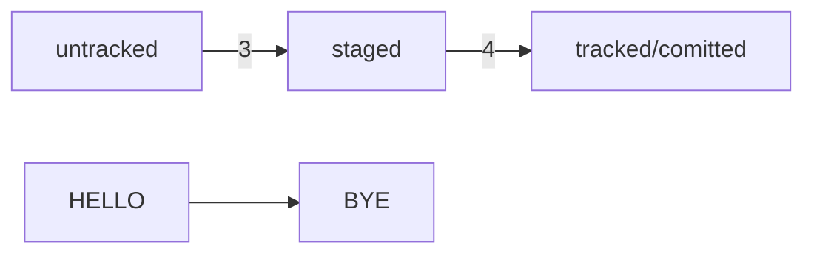

# Лабораторная работа №3
## Начало работы c Git
Выполнил ст гр 11405121

Шаботько Светлана 
## Инициализируем репозиторий
### Сделать папку репозиторием - git init 
Чтобы Git начал отслеживать изменения в проекте, папку с файлами можно сделать Git-репозиторием. Для этого нужно переместится в нее и ввести команду.


### «Разгитить» папку, если что-то пошло не так, — rm -rf .git

Если вы случайно сделали Git-репозиторием не ту папку, её можно «разгитить». Для этого нужно
удалить скрытую подпапку .git.
```
$ cd <папка с репозиторием> # перешли в папку
$ rm -rf .git # удалили подпапку .git
```


### Проверить состояние репозитория — git status
После инициализации репозитория first-project запустите команду git status (от англ. status — «статус», «состояние») — она показывает текущее состояние репозитория.


### Подготовить файлы к сохранению — git add и git add --all


Важно помнить, что после каждого исправления файла нужно сохранять их с помощью коаманды git add или git add с флагом *--add*
## Делаем первый коммит
Сделать коммит можно командой git commit c ключом -m (от англ. message — «сообщение»),
который присваивает коммиту сообщение.


## Задание для самостоятельной работы


## Знакомство с GitHub

До этого момента вы использовали Git локально: сейчас проект first-project хранится только на вашем компьютере. Но одно из ключевых преимуществ Git — удобство командной работы над файлами. Чтобы поделиться репозиторием — например, с коллегами, — нужно завести его удалённую версию.

## Создаём удалённый репозиторий
В этой работе будем использовать уже существующий репозиторий на Github TPIOG2023. Устанавливаем утилиту xclip и копируем ключ
```
sudo apt install xclip
```

Генерируем SSH ключ


Копируем ключ


Потом заходим в гитхаб и вставляем туда скопированный ключ


Теперь, чтобы проверить что все получилось, переходим в терминал и вводимм команду
```
ssh -T git@github.com
```


Теперь нужно связать наш удаленный репозиторий с репозиторием на гитхаб
```
git remote --add

git pish -u origin main
```


Теперь переходим на гитхаб и видим какие появились изменения.


## Синхронизируем репозитории
```
git push
```


# Практическая работа No1


# Практическая работа No2
Попробуем использовать формат описания схем Mermaid. Принцип такой: вы описываете схему в специальном текстовом формате, а GitHub превращает описание в полноценную схему с блоками и стрелками.
```
modified +git add = staged
```

# Практическая работа №3. Нужно откатить изменения

## Когда написаk ненужное

```
git restore <file>
```

## Когда уже накоммитил

```
git reset --hard <time travel!>
```

# Практическая работа №4. Исследуем историю коммитов

Нам понадобятся команды `git log` и `git diff`.

