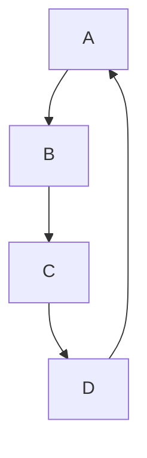
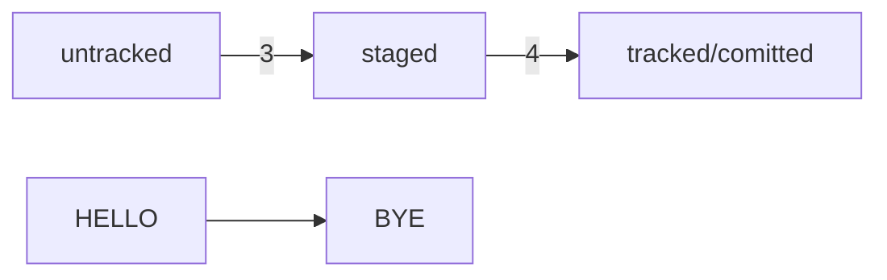

### Лабораторная работа №3

## Начало работы с Git
Выполнил: ст. гр. 11405121

Рак И. П.

Проверил: старший преподаватель

Будо А. Ю.

Создаем папку first-project, где будет два файла todo.txt и readme.txt, в которых содержаться: файл todo.txt, в котором будет список дел, и readme.txt для информации о проекте.

`$ touch todo.txt`

`$ touch readme.txt`

Инициализируем репозиторий.

Сделать папку репозиторием - `git init`


Чтобы Git начал отслеживать изменения в проекте, папку с файлами можно сделать Git-репозиторием. Для этого нужно переместится в нее и ввести команду.

«Разгитить» папку, если что-то пошло не так, — `rm -rf .git.`

Если вы случайно сделали Git-репозиторием не ту папку, её можно «разгитить». Для этого нужно удалить скрытую подпапку .git.

`$ cd <папка с репозиторием>` # перешли в папку

`$ rm -rf .git` # удалили подпапку .git

Проверить состояние репозитория — `git status`

После инициализации репозитория first-project запустите команду git status (от англ. status — «статус», «состояние») — она показывает текущее состояние репозитория.


Подготовить файлы к сохранению — `git add` и `git add --all`


Важно помнить, что после каждого исправления файла нужно сохранять их с помощью коаманды git add или git add с флагом *--add*.

# Делаем первый коммит

Сделать коммит можно командой git commit c ключом -m (от англ. message — «сообщение»), который присваивает коммиту сообщение.


# Задание для самостоятельной работы


# Знакомство с GitHub

До этого момента вы использовали Git локально: сейчас проект first-project хранится только на вашем компьютере. Но одно из ключевых преимуществ Git — удобство командной работы над файлами. Чтобы поделиться репозиторием — например, с коллегами, — нужно завести его удалённую версию.

# Создаём удалённый репозиторий

В этой работе будем использовать уже существующий репозиторий на Github first-project. Устанавливаем утилиту xclip и копируем ключ

Устанавливаем утилиту xclip.

`$ sudo apt install xclip`


# Генерируем SSH-ключ

Генерируем и проверяем SSH-ключ


Копируем ключ.


Вставляем в настройках в гитхабе


# Связываем локальный и удалённый репозитории


Проверка. 


# Синхронизируем локальный и удалённый репозитории

Если 2 раза нажать на Tab, то можно узнать, что надо писать в своей версии linux: main или master.


Заходим на гитхаб.


#Практическая работа №1


# Практическая работа №2






# Практическая работа №3

Когда написал ненужное: ```git restore <file>```

Когда уже накоммитил: ```git reset --hard <time travel!>```

# Практическая работа №4

Нам понадобятся команды `git log` и `git diff`.
